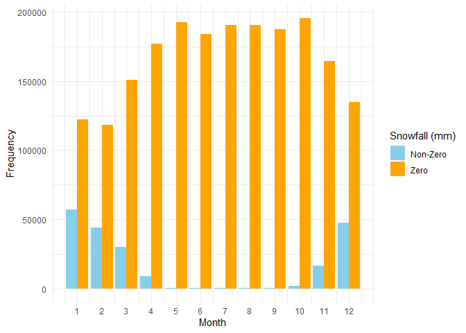
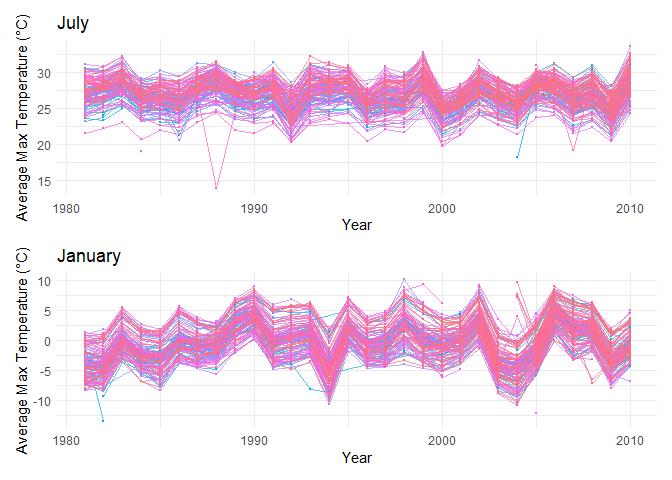
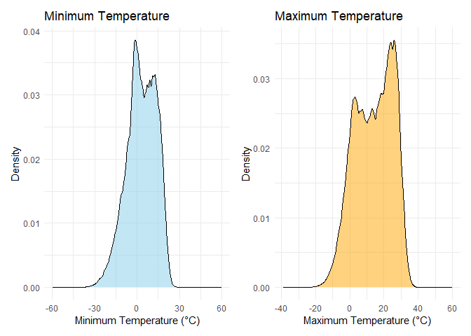

p8105_hw3_WL3011
================
Weiqi Liang
2024-10-12

## Setup File

``` r
library(tidyverse)
library(dplyr)
library(knitr)
library(kableExtra)
library(ggplot2)
library(patchwork) 
```

## Problem 1

Firstly load the data.

``` r
library(p8105.datasets)
data("ny_noaa")
```

Dataset **NY NOAA** has 2595176 rows and 7 columns, showing a list of
all GHCND-Daily weather stations in New York state with weather data,
respectively. The variables include:

- `id`: Weather station ID
- `date`: Date of observation
- `prcp`: Precipitation ($10^{-1}$ mm)
- `snow`: The amount of snowfall (mm)
- `snwd`: Snow depth (mm)
- `tmax`: Maximum temperature ($10^{-1}$ °C)
- `tmin`: Minimum temperature ($10^{-1}$ °C)

### 1.1 Data Cleaning

- Create separate variables for year, month, and day.
- Convert `prcp`, `tmax`, `tmin` to standard units, i.e., mm and degree
  Celsius, respectively.

``` r
# basic dataset: ny_noaa
ny_noaa = ny_noaa |>

  mutate(
    year = format(pull(ny_noaa, date), "%Y"),
    month = format(pull(ny_noaa, date), "%m"),
    day = format(pull(ny_noaa, date), "%d")
    ) |>
  relocate(id, date, year, month, day) |> 
  mutate(
    across(-c(date, id), as.numeric),
    prcp = prcp / 10,     
    tmax = tmax / 10,     
    tmin = tmin / 10      
  )
```

``` r
snowfall_frequency = ny_noaa |>
  count(snow, sort = TRUE)  # sort = TRUE means descending
head(snowfall_frequency)
```

    ## # A tibble: 6 × 2
    ##    snow       n
    ##   <dbl>   <int>
    ## 1     0 2008508
    ## 2    NA  381221
    ## 3    25   31022
    ## 4    13   23095
    ## 5    51   18274
    ## 6    76   10173

``` r
snowfall_df = ny_noaa |>
  filter(!is.na(snow)) |>
  mutate(snowfall_category = ifelse(snow == 0, "Zero", "Non-Zero")) |>
  count(month, snowfall_category)

# bar plot
ggplot(snowfall_df, aes(x = month, y = n, fill = snowfall_category)) +
  geom_bar(stat = "identity", position = "dodge") +
  labs(
    x = "Month", 
    y = "Frequency"
    ) +
  scale_fill_manual(
    name = "Snowfall (mm)", 
    values = c("Zero" = "orange", "Non-Zero" = "skyblue")
    ) +
  scale_x_continuous(breaks = 1:12) + 
  theme_minimal()
```

<figure>

<figcaption aria-hidden="true">Figure 1. Frequency of Zero and Non-Zero
Snowfall(mm) by Month</figcaption>
</figure>

- For `snow`, the most commonly observed values is **0**. from the
  figure above, it is obvious that the number of snowy days is far fewer
  than the number of non-snowy days. Therefore, the most observed amount
  of snowfall is 0.

### 1.2 Average Max Temperature

Plot below shows the average max temperature in January and in July in
each station across years.

``` r
# each stations' average max temperature in January & July 
avg_tmax_df = ny_noaa |> 
  filter(month == 1 | month == 7) |>
  group_by(id, month, year) |>
  mutate(
    avg_tmax = mean(tmax, na.rm = TRUE)
    ) |>
  ungroup() |>
  distinct(id, year, month, avg_tmax) |>
  pivot_wider(
    names_from = month, 
    values_from = avg_tmax,
    names_prefix = "month_"
  )

# Create separate plots for January and July

# Plot for January
p_january = ggplot(avg_tmax_df, aes(x = year)) +
  geom_line(aes(y = month_1, color = id, group = id), size = .1) +
  geom_point(aes(y = month_1, color = id), size = .2) +
  labs(
    x = "Year", 
    y = "Average Max Temperature (°C)", 
    color = "Month",
    title = "January"
    ) +
  guides(color = "none") +
  theme_minimal()
```

    ## Warning: Using `size` aesthetic for lines was deprecated in ggplot2 3.4.0.
    ## ℹ Please use `linewidth` instead.
    ## This warning is displayed once every 8 hours.
    ## Call `lifecycle::last_lifecycle_warnings()` to see where this warning was
    ## generated.

``` r
  scale_color_discrete() 
```

    ## <ggproto object: Class ScaleDiscrete, Scale, gg>
    ##     aesthetics: colour
    ##     axis_order: function
    ##     break_info: function
    ##     break_positions: function
    ##     breaks: waiver
    ##     call: call
    ##     clone: function
    ##     dimension: function
    ##     drop: TRUE
    ##     expand: waiver
    ##     get_breaks: function
    ##     get_breaks_minor: function
    ##     get_labels: function
    ##     get_limits: function
    ##     get_transformation: function
    ##     guide: legend
    ##     is_discrete: function
    ##     is_empty: function
    ##     labels: waiver
    ##     limits: NULL
    ##     make_sec_title: function
    ##     make_title: function
    ##     map: function
    ##     map_df: function
    ##     n.breaks.cache: NULL
    ##     na.translate: TRUE
    ##     na.value: grey50
    ##     name: waiver
    ##     palette: function
    ##     palette.cache: NULL
    ##     position: left
    ##     range: environment
    ##     rescale: function
    ##     reset: function
    ##     train: function
    ##     train_df: function
    ##     transform: function
    ##     transform_df: function
    ##     super:  <ggproto object: Class ScaleDiscrete, Scale, gg>

``` r
# Plot for July
p_july = ggplot(avg_tmax_df, aes(x = year)) +
  geom_line(aes(y = month_7, color = id, group = id), size = .1) +
  geom_point(aes(y = month_7, color = id), size = .2) +
  labs(
    x = "Year", 
    y = "Average Max Temperature (°C)", 
    color = "Month",
    title = "July"
    ) +
  guides(color = "none") +
  theme_minimal() +
  scale_color_discrete() 

# Combine
p_january + p_july
```

    ## Warning: Removed 3261 rows containing missing values or values outside the scale range
    ## (`geom_line()`).

    ## Warning: Removed 3329 rows containing missing values or values outside the scale range
    ## (`geom_point()`).

    ## Warning: Removed 3251 rows containing missing values or values outside the scale range
    ## (`geom_line()`).

    ## Warning: Removed 3348 rows containing missing values or values outside the scale range
    ## (`geom_point()`).

<figure>

<figcaption aria-hidden="true">Figure 2. Average Max Temperature in
January and July Across Years</figcaption>
</figure>

Figure 2 above shows a few patterns and observations stand out:

- Seasonal Variation:

July consistently shows much higher average maximum temperatures (20 to
30°C) compared to January (-10 to 10°C). This reflects the typical
seasonal difference between winter and summer.

- Parallel Trends Across Stations

The year-to-year January and July maximum temperatures recorded at each
weather station maintain a parallel pattern, i.e., they have a similar
trend of change.

- Outliers:

There are a few sharp drops (e.g., July showing one or two sudden drops
below 20°C and January dipping below -10°C). These might indicate
unusual weather events.

- Noise in January Data:

Compared to the July data, the January data fluctuated more between 1981
and 2010 and had discrete extremes at some stations in 2004. This could
indicate that January weather is more unpredictable, perhaps due to
snow, storms, or varying cold fronts.

### 1.3 tmax vs Tmin

Make a two-panel plot showing (note that a scatterplot may not be the
best option);

``` r
p_tmax = ggplot(ny_noaa, aes(x = tmax)) +
  geom_density(fill = "orange", alpha = 0.5) +
  labs(title = "Maximum Temperature",
       x = "Maximum Temperature (°C)",
       y = "Density") +
  theme_minimal()

p_tmin = ggplot(ny_noaa, aes(x = tmin)) +
  geom_density(fill = "skyblue", alpha = 0.5) +
  labs(title = "Minimum Temperature",
       x = "Minimum Temperature (°C)",
       y = "Density") +
  theme_minimal()

# Combine 
p_tmin + p_tmax
```

    ## Warning: Removed 1134420 rows containing non-finite outside the scale range
    ## (`stat_density()`).

    ## Warning: Removed 1134358 rows containing non-finite outside the scale range
    ## (`stat_density()`).

<figure>

<figcaption aria-hidden="true">Figure 3. Density Plot of Maximum vs
Minimum Temperature</figcaption>
</figure>

### 1.4 Distribution of Snowfall

2)  make a plot showing the distribution of snowfall values greater than
    0 and less than 100 separately by year.

``` r
p2 = ny_noaa |>
  filter(snow > 0 & snow < 100) |>
  ggplot(aes(x = snow, fill = factor(year))) +
  geom_histogram(position = "dodge", bins = 10, alpha = 0.7) +  # Histogram
  labs(
    title = "Distribution of Snowfall Values (0 < Snowfall < 100)",
    x = "Snowfall (mm)",
    y = "Frequency",
    fill = "Year"
  ) +
  theme_minimal()
```

## II. Problem 2

## III. Problem 3
