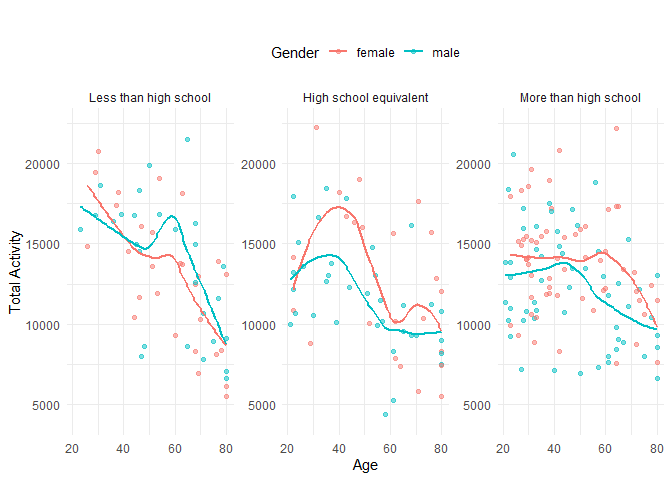
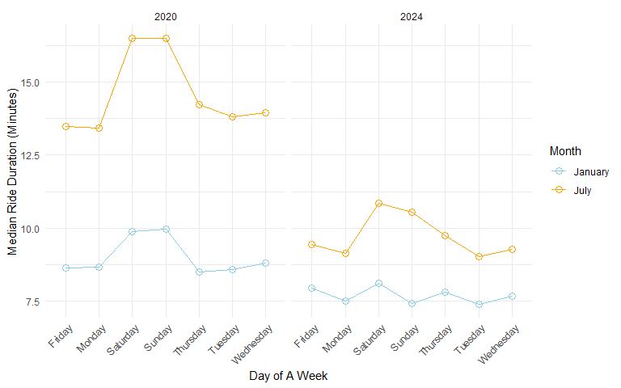

p8105_hw3_WL3011
================
Weiqi Liang
2024-10-16

## Setup File

``` r
library(tidyverse)
library(dplyr)
library(knitr)
library(ggplot2)
library(patchwork) 
library(ggridges)
```

## Problem 1

Firstly load the data.

``` r
library(p8105.datasets)
data("ny_noaa")
```

Dataset **NY NOAA** has 2595176 rows and 7 columns, showing a list of
all GHCND-Daily weather stations in New York state with weather data,
respectively. The variables include:

- `id`: Weather station ID
- `date`: Date of observation
- `prcp`: Precipitation ($10^{-1}$ mm)
- `snow`: The amount of snowfall (mm)
- `snwd`: Snow depth (mm)
- `tmax`: Maximum temperature ($10^{-1}$ °C)
- `tmin`: Minimum temperature ($10^{-1}$ °C)

### 1.1 Data Cleaning

- Create separate variables for year, month, and day.
- Convert `prcp`, `tmax`, `tmin` to standard units, i.e., mm and degree
  Celsius, respectively.

``` r
# basic dataset: ny_noaa
ny_noaa = ny_noaa |>

  mutate(
    year = format(pull(ny_noaa, date), "%Y"),
    month = format(pull(ny_noaa, date), "%m"),
    day = format(pull(ny_noaa, date), "%d")
    ) |>
  relocate(id, date, year, month, day) |> 
  mutate(
    across(-c(date, id), as.numeric),
    prcp = prcp / 10,     
    tmax = tmax / 10,     
    tmin = tmin / 10      
  )
```

``` r
snowfall_frequency = ny_noaa |>
  count(snow, sort = TRUE)  # sort = TRUE means descending
head(snowfall_frequency)
```

    ## # A tibble: 6 × 2
    ##    snow       n
    ##   <dbl>   <int>
    ## 1     0 2008508
    ## 2    NA  381221
    ## 3    25   31022
    ## 4    13   23095
    ## 5    51   18274
    ## 6    76   10173

``` r
snowfall_df = ny_noaa |>
  filter(!is.na(snow)) |>
  mutate(snowfall_category = ifelse(snow == 0, "Zero", "Non-Zero")) |>
  count(month, snowfall_category)

# bar plot
ggplot(snowfall_df, aes(x = month, y = n, fill = snowfall_category)) +
  geom_bar(stat = "identity", position = "dodge") +
  labs(
    x = "Month", 
    y = "Frequency"
    ) +
  scale_fill_manual(
    name = "Snowfall (mm)", 
    values = c("Zero" = "orange", "Non-Zero" = "skyblue")
    ) +
  scale_x_continuous(breaks = 1:12) + 
  theme_minimal()
```

<figure>

<figcaption aria-hidden="true">Figure 1. Frequency of Zero and Non-Zero
Snowfall(mm) by Month</figcaption>
</figure>

- For `snow`, the most commonly observed values is **0**. from the
  figure above, it is obvious that the number of snowy days is far fewer
  than the number of non-snowy days. Therefore, the most observed amount
  of snowfall is 0.

### 1.2 Average Max Temperature

Plot below shows the average max temperature in January and in July in
each station across years.

``` r
# each stations' average max temperature in January & July 
avg_tmax_df = ny_noaa |> 
  filter(month == 1 | month == 7) |>
  group_by(id, month, year) |>
  mutate(
    avg_tmax = mean(tmax, na.rm = TRUE)
    ) |>
  ungroup() |>
  distinct(id, year, month, avg_tmax) |>
  pivot_wider(
    names_from = month, 
    values_from = avg_tmax,
    names_prefix = "month_"
  )

# Create separate plots for January and July

# Plot for January
p_january = ggplot(avg_tmax_df, aes(x = year)) +
  geom_line(aes(y = month_1, color = id, group = id), size = .1, alpha = .7) +
  geom_point(aes(y = month_1, color = id), size = .2) +
  labs(
    x = "Year", 
    y = "Average Max Temperature (°C)", 
    color = "Month",
    title = "January"
    ) +
  guides(color = "none") +
  theme_minimal() +
  scale_color_discrete() 

# Plot for July
p_july = ggplot(avg_tmax_df, aes(x = year)) +
  geom_line(aes(y = month_7, color = id, group = id), size = .1, alpha = .7) +
  geom_point(aes(y = month_7, color = id), size = .2) +
  labs(
    x = "Year", 
    y = "Average Max Temperature (°C)", 
    color = "Month",
    title = "July"
    ) +
  guides(color = "none") +
  theme_minimal() +
  scale_color_discrete() 

# Combine
p_july / p_january
```

<figure>

<figcaption aria-hidden="true">Figure 2. Average Max Temperature in
January and July Across Years</figcaption>
</figure>

Figure 2 above shows a few patterns and observations stand out:

- Seasonal Variation:

July consistently shows much higher average maximum temperatures (20 to
30°C) compared to January (-10 to 10°C). This reflects the typical
seasonal difference between winter and summer.

- Parallel Trends Across Stations

The year-to-year January and July maximum temperatures recorded at each
weather station maintain a parallel pattern, i.e., they have a similar
trend of change.

- Outliers:

There are a few sharp drops (e.g., July showing one or two sudden drops
below 20°C and January dipping below -10°C). These might indicate
unusual weather events.

- Noise in January Data:

Compared to the July data, the January data fluctuated more between 1981
and 2010 and had discrete extremes at some stations in 2004. This could
indicate that January weather is more unpredictable, perhaps due to
snow, storms, or varying cold fronts.

### 1.3 Tmax vs Tmin

Make a two-panel plot showing (note that a scatterplot may not be the
best option);

``` r
p_tmax = ggplot(ny_noaa, aes(x = tmax)) +
  geom_density(fill = "orange", alpha = 0.5) +
  labs(title = "Maximum Temperature",
       x = "Maximum Temperature (°C)",
       y = "Density") +
  theme_minimal()

p_tmin = ggplot(ny_noaa, aes(x = tmin)) +
  geom_density(fill = "skyblue", alpha = 0.5) +
  labs(title = "Minimum Temperature",
       x = "Minimum Temperature (°C)",
       y = "Density") +
  theme_minimal()

# Combine 
p_tmin + p_tmax
```

<figure>

<figcaption aria-hidden="true">Figure 3. Density Plot of Maximum and
Minimum Temperature</figcaption>
</figure>

### 1.4 Distribution of Snowfall

2)  make a plot showing the distribution of snowfall values greater than
    0 and less than 100 separately by year.

``` r
library(ggridges)

p2 = ny_noaa |>
  filter(snow > 0 & snow < 100) |>
  ggplot(aes(x = snow, y = year, fill = factor(year))) +
  geom_density_ridges(scale = 1.5, rel_min_height = 0.01) +  
  labs(
    x = "Snowfall (mm)",
    y = "Year",
    fill = "Year"
  ) +
  scale_y_continuous(
    breaks = seq(1980, 2010, by = 5) 
  ) + 
  theme_minimal() +
  theme(legend.position = "none")

print(p2)
```

<figure>

<figcaption aria-hidden="true">Figure 4. Annual Snowfall Values
Distribution</figcaption>
</figure>

## II. Problem 2

### 2.1 Load and Organize Datasets

- Include all originally observed variables;  
- Exclude participants less than 21 years of age;
- Exclude participants with missing demographic data;  
- Encode data with reasonable variable classes (i.e. not numeric, and
  using factors with the ordering of tables and plots in mind).

``` r
accel_df = 
  read_csv("./nhanes_accel.csv", 
           na = c("NA", ".", "")) |>
  janitor::clean_names() |>
  drop_na() 

covar_df = 
  read_csv("./nhanes_covar.csv", 
           na = c("NA", ".", ""), skip = 4) |>
  janitor::clean_names() |>
  drop_na() |>
  mutate(          
    gender = case_match(
      sex,
      1 ~ "male",
      2 ~ "female" 
    )
  ) |>
  mutate(
    category = case_match(
      education,
      1 ~ "Less_than_high_school",
      2 ~ "High_school_equivalent",
      3  ~ "More_than_high_school"
    )
  )

nhanes_df = 
  inner_join(covar_df, accel_df, by = "seqn") |>
  filter(age >= 21)
```

### 2.2 Table for Participants’ Number

The reader-friendly table for the number of men and women in each
education category is as follows:

``` r
num_sex_df = 
  covar_df |>
  count(sex, education, name = "number") |> 
  arrange(sex, education) |>
  mutate(          
    sex = case_match(
      sex,
      1 ~ "male",
      2 ~ "female" 
    )
  ) |>
  mutate(
    education = case_match(
      education,
      1 ~ "Less_than_high_school",
      2 ~ "High_school_equivalent",
      3  ~ "More_than_high_school"
    )
  )

kable(num_sex_df, 
      col.names = c("Gender", "Education", "Number"),
      caption = "Table 1. Number of Men and Women by Education Category")
```

| Gender | Education              | Number |
|:-------|:-----------------------|-------:|
| male   | Less_than_high_school  |     27 |
| male   | High_school_equivalent |     36 |
| male   | More_than_high_school  |     56 |
| female | Less_than_high_school  |     28 |
| female | High_school_equivalent |     23 |
| female | More_than_high_school  |     59 |

Table 1. Number of Men and Women by Education Category

### 2.3 Age Distribution

The plot consists of three facets representing the three education
categories. Each facet shows the age distribution for men and women
using overlapping density plots.

``` r
#label for the 3 small plot
edu_labels = c(
  "1" = "Less than high school",
  "2" = "High school equivalent",
  "3" = "More than high school"
)

ggplot(covar_df, aes(x = age, fill = gender)) +
  geom_density(alpha = 0.3) + 
  facet_wrap(~ education, nrow = 1, labeller = as_labeller(edu_labels)) +  
  labs(
    x = "Age", 
    y = "Density",
    fill = "sex"
  ) +
  theme_minimal() +
  theme(legend.position = "top")
```

<figure>

<figcaption aria-hidden="true">Figure 5. Age Distributions by Sex and
Education Category</figcaption>
</figure>

**Observations by Education Category:**

1.  Less than High School:

- A prominent peak around age 70 is visible for both genders.

- Women generally have higher densities after age 50, suggesting a
  larger proportion of older women in this education level.

2.  High School Equivalent:

- Both men and women show two peaks: one around age 30 and another
  around age 60.

- There seems to be a higher concentration of older individuals (60+)
  compared to younger ones for female group.

3.  More than High School:

- There is a strong peak around age 30 for both men and women.

- After age 50, the densities decrease significantly, meaning fewer
  older individuals have education levels above high school.

- The distributions for men and women are very similar, though women
  show a slight advantage in the younger age group.

**Gender Differences:**

especially in the “High School Equivalent” category, male and female
participants showed significant age differences, with younger males and
older females significantly outnumbering those of the opposite sex at
the same age.

### 2.4 Total Activity

Create a scatter plot with a smooth trend line meeting the following
needs:

- Create a `total_activity` variable for each participant;

- Plot the `total_activity` against `age`, by `sex` and `education`.

``` r
total_activity_df = 
  nhanes_df |> 
  group_by(seqn, gender, age, education) |> 
 summarise(
    total_activity = rowSums(across(starts_with("min")), na.rm = TRUE),
    .groups = "drop"
    )

activity_plot = ggplot(total_activity_df, aes(x = age, y = total_activity, color = gender)) +
  geom_point(alpha = 0.5) +  
  geom_smooth(method = "loess", se = FALSE) +  
  scale_y_continuous(
    limits = c(4000, 22500), 
    breaks = seq(5000, 20000, by = 5000) 
  ) + 
  facet_wrap(~ education, scales = "free_y", labeller = as_labeller(edu_labels)) + 
  labs(
    title = "",
    x = "Age",
    y = "Total Activity",
    color = "Gender"
  ) +
  theme_minimal() +
  theme(legend.position = "top")

print(activity_plot)
```

<figure>

<figcaption aria-hidden="true">Figure 6. Total Activity vs Age by Gender
and Education Level</figcaption>
</figure>

**Observations and Patterns:**

Overall, across all education levels, total activity tends to decline
with increasing age. Gender differences are consistent, with men
generally being less active than women.

1.  Less than High School:

- A clear decline in activity as age increases. Both men and women show
  a sharp drop after the age of 60.

2.  High School Equivalent:

- Activity declines gradually, but there is an increase around age 70
  before dropping again.

3.  More than High School:

Activity levels are lower for both men and women, especially in early
adulthood. There is less variability, with a smoother decline across all
ages.

### 2.4 24-Hour Activity Time Courses

``` r
summary_df = 
  nhanes_df |>
  pivot_longer(
    min1:min1440,
    names_to = "minute",
    values_to = "min_value",
    names_prefix = "min"
    ) |>
  mutate(minute = as.numeric(minute)) |>
  group_by(minute, gender, education) |>
  summarise(mean_min = mean(min_value)) 

# Create the 3-panel plot
ggplot(summary_df, aes(x = minute /60, y = mean_min, color = gender)) +
  geom_point(alpha = 0.1) +  
  geom_smooth(method = "loess", se = FALSE) +  
  facet_wrap(~ education, nrow = 1, labeller = as_labeller(edu_labels)) + 
  labs(
    x = "Hour of the Day",
    y = "Mean Activity Level",
     color = "gender"
  ) +
  scale_x_continuous(
    breaks = seq(0, 24, by = 4),  
    labels = seq(0, 24, by = 4), 
    limits = c(0, 24)  
  ) +
  theme_minimal() +
  theme(
    strip.text = element_text(size = 12), 
    plot.title = element_text(hjust = 0.5)  
  )
```

<figure>

<figcaption aria-hidden="true">Figure 7. 24-Hour Activity Time Courses
by Education Level and Gender</figcaption>
</figure>

- In all educational levels, it is clear that activity levels increase
  in the morning, peak in the afternoon (with a a little drop in
  between), and gradually decline in the evening.

- Across all three educational categories, females tend to have slightly
  higher activity levels during the peak hours compared to males.

## III. Problem 3

Import, clean, combine and tidy these data.

``` r
#read csv
jan_2020 = read_csv("./citibike/Jan 2020 Citi.csv", 
           na = c("NA", ".", "")) |>
           janitor::clean_names() |>
           mutate(year = 2020, month = "January")

july_2020 = read_csv("./citibike/July 2020 Citi.csv", 
           na = c("NA", ".", "")) |>
           janitor::clean_names() |>
           mutate(year = 2020, month = "July")

jan_2024 = read_csv("./citibike/Jan 2024 Citi.csv", 
           na = c("NA", ".", "")) |>
           janitor::clean_names() |>
           mutate(year = 2024, month = "January")

july_2024 = read_csv("./citibike/July 2024 Citi.csv", 
           na = c("NA", ".", "")) |>
           janitor::clean_names() |>
           mutate(year = 2024, month = "July")

citibike_df = bind_rows(jan_2020, july_2020, jan_2024, july_2024) |>
  relocate(year, month)
```

There are 99485 rides across all four months. Every month’s file
consists of the following 7 columns:

`ride_id`: Each rides’ ID;

`rideable_type`: The type of bike used, such as “classic_bike”;

`weekdays`: The day of the week when the ride occurred;

`duration`: The duration of the ride, in minutes;

`start_station_name`: The name of the station where the ride started;

`end_station_name`: The name of the station where the ride ended;

`member_casual`: Whether the rider is a member or a casual user.

A small number of entries have missing data in the `start_station_name`
and `end_station_name` columns. But these observations are retained for
the time being, as they are still valid for counting the number of
activities and activity habits of rides.

### 3.1 Table of Total Number of Rides

``` r
ride_counts = citibike_df |>
  group_by(year, month, member_casual) |>
  summarise(total_rides = n(), .groups = 'drop')

ride_counts_wide = ride_counts |>
  pivot_wider(
    names_from = member_casual, 
    values_from = total_rides, 
    )

kable(ride_counts_wide, 
      col.names = c("Year", "Month", "Causal","Member"),
      caption = "Table 2. Total Number of Rides of Casual Riders and Citi Bike Members")
```

| Year | Month   | Causal | Member |
|-----:|:--------|-------:|-------:|
| 2020 | January |    984 |  11436 |
| 2020 | July    |   5637 |  15411 |
| 2024 | January |   2108 |  16753 |
| 2024 | July    |  10894 |  36262 |

Table 2. Total Number of Rides of Casual Riders and Citi Bike Members

Between 2020 and 2024, there is a significant increase in the number of
rides for both casual rides and members. Additionally, there is a clear
seasonality in the data, with more rides occurring in July compared to
January in both years, particularly for casual rides.

### 3.2 Table of Top 5 Popular Start Stations

``` r
top_stations = july_2024 |>
  group_by(start_station_name) |>
  summarise(total_rides = n()) |>
  arrange(desc(total_rides)) |>
  slice_head(n = 5)

kable(top_stations, 
      col.names = c("Start Station Name", "Total Rides"),
      caption = "Table 3. Top 5 Popular Start Stations")
```

| Start Station Name       | Total Rides |
|:-------------------------|------------:|
| Pier 61 at Chelsea Piers |         163 |
| University Pl & E 14 St  |         155 |
| W 21 St & 6 Ave          |         152 |
| West St & Chambers St    |         150 |
| W 31 St & 7 Ave          |         146 |

Table 3. Top 5 Popular Start Stations

### 3.3 Plot of

``` r
#median
ride_duration_median = citibike_df |>
  group_by(year, month, weekdays) |>
  summarise(median_duration = median(duration), .groups = 'drop')

#the effects on median ride duration
ggplot(ride_duration_median, aes(x = weekdays, y = median_duration, color = month)) +
  geom_line(aes(group = month)) + 
geom_point(aes(group = month), shape = 1, size = 3) +
  facet_wrap(~ year) +
  scale_color_manual(
    values = c("January" = "skyblue", "July" = "orange"),
    labels = c("January","July")
  ) +
  labs(
    x = "Day of A Week",
    y = "Median Ride Duration (Minutes)",
    color = "Month"
  ) +
  theme_minimal() +
  theme(axis.text.x = element_text(angle = 45, hjust = 1))
```

<figure>

<figcaption aria-hidden="true">Figure 8. Median Ride Duration by Day of
Week, Month, and Year</figcaption>
</figure>

- The median length of rides in both January and July in 2024 is
  significantly lower than the same period in 2020.

- Typically weekdays have shorter ride duration, while weekends have
  longer ride lengths because recreational riding may be more frequent.

- Summer months (July) have longer rides, probably because the weather
  is more suitable for outdoor activities, while winter months (January)
  have shorter rides in comparison.
